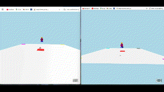

# Small-XR-Server

A small server application for shared XR experiences. It is written with PHP and uses the SleekDB (flat file NoSQL DB) to store users' data (currently id, position and rotation).  

It comes with a client written with <a href="https://github.com/aframevr/aframe" target="new">A-Frame</a>. 

## Development status:
- A user is created with each browser session. Its position and rotation, accompanied by its ID is stored in DB and updated when position is changed.
- Clients retrieve stored data and refresh the appearance of other users using avatars.

## Uses: 
- PHP 8
- Flat file DB https://sleekdb.github.io/
